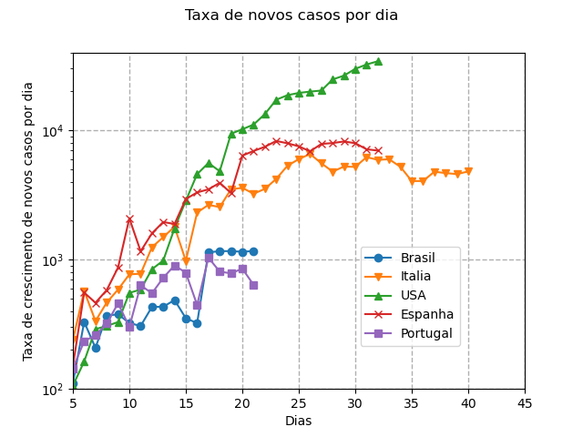
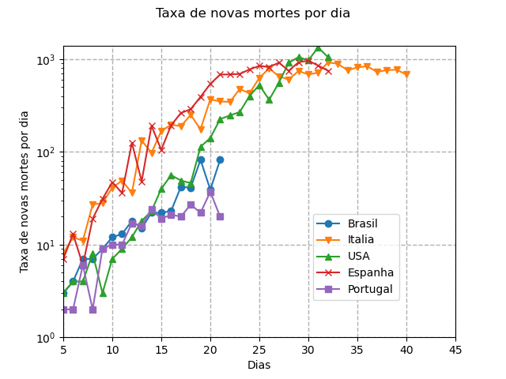

# Covid-19

Gráficos da evolução dos casos e mortes do covid-19. Todos os gráficos iniciam-se apartir da data que os paises tem mais de 100 casos.

## Paises

* Brasil
* Espanha
* Itália
* EUA
* Portugal

## Ultima atualização

04/04/2020

## Gráficos

### Total de Casos

### Total de Mortes

### Taxa de variação de novos casos por dia

### Taxa de variação de novas mortes por dia
