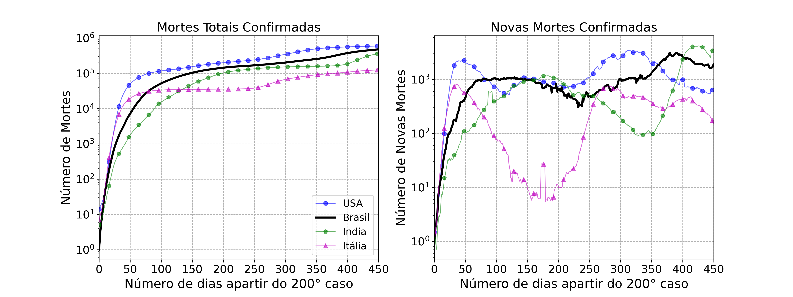
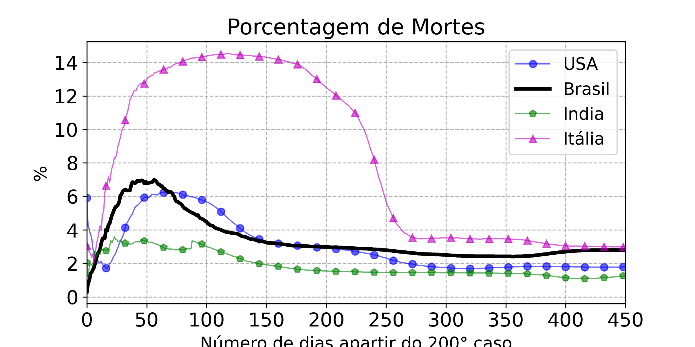
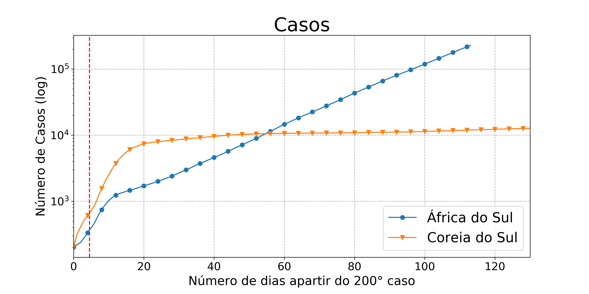

# Covid-19

Gráficos da evolução dos casos e mortes do covid-19. Todos os gráficos iniciam-se apartir da data que os paises tem mais de 100 casos.

## Paises

* Brasil
* Espanha
* Itália
* EUA
* Russia
* Alemanha

## Ultima atualização

05/05/2020

## Gráficos

### Total de Casos e taxa de variação de novos casos por dia

### Total de Mortes e taxa de variação de novos casos por dia

### Porcentual de mortes 

### Comparação da África do Sul com a Coreia do Sul 
