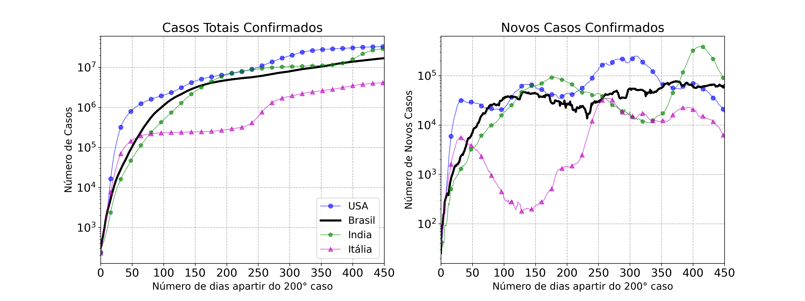

# Covid-19

Gráficos da evolução dos casos e mortes do covid-19. Todos os gráficos iniciam-se apartir da data que os paises tem mais de 100 casos.

## Paises

* Brasil
* EUA
* India
* Itália

## Ultima atualização

31/03/2021

## Gráficos

### Total de Casos e taxa de variação de novos casos por dia

### Total de Mortes e taxa de variação de novos casos por dia

### Casos e Mortes por milhão 

### Porcentual de mortes 

